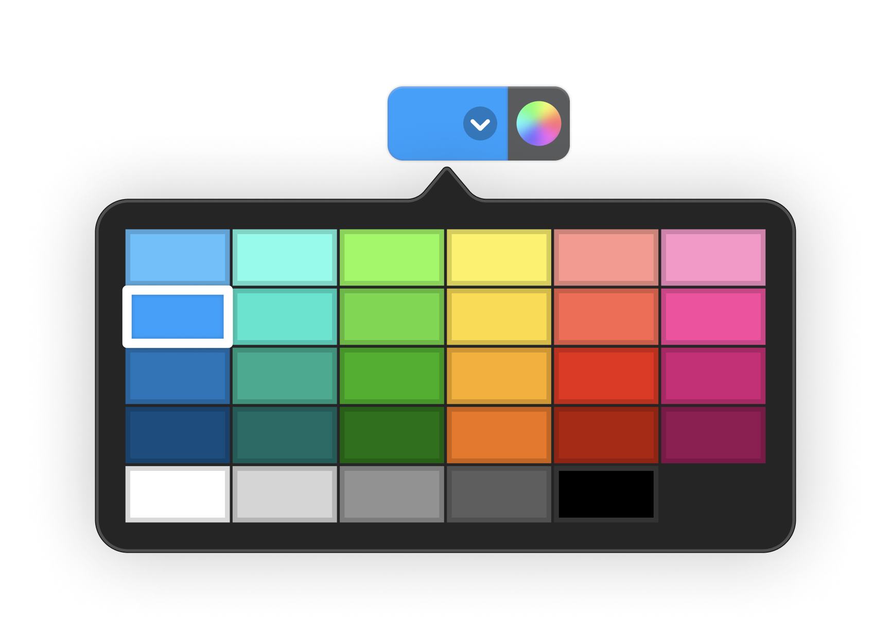

<div align="center">
    
</div>

<p align="center"> <b>ColorWellKit It's a SwiftPackage for NSColorWell for Cocoa and ColorPicker.</b></p>

<p align="center">

<a href="https://developer.apple.com/swift/"></a>


<a href="https://twitter.com/LiuChuan_"></a>
</p>


## Overview

ColorWellKit is designed to mimic the appearance and behavior of the color well designs introduced in macOS 13 Ventura, ideal for use in apps that are unable to target the latest SDK.


| Light mode      | Dark mode      | 
| --------------- | -------------- | 
| ![][light-mode] | ![][dark-mode] | 

| light-popover   | dark-popover   | 
| --------------- | -------------- | 
| ![][light-popover] | ![][dark-popover] | 


[light-popover]: Design/Resources/color-well-with-popover-light.png
[dark-popover]: Design/Resources/color-well-with-popover-dark.png

[light-mode]: Design/Resources/design-comparison-light.png
[dark-mode]: Design/Resources/design-comparison-dark.png


## Topics

### Color Wells in Cocoa

- ``CWColorWell``

### Color Wells in SwiftUI

- ``ColorWell``


## Cocoa

Create a ``CWColorWell`` using one of the available initializers. Respond to color changes using your preferred design pattern (see <doc:ColorObservation>):

```swift
import Cocoa
import ColorWellKit

class ContentViewController: NSViewController {
    @IBOutlet var textControls: NSStackView!
    @IBOutlet var textEditor: MyCustomNSTextEditor!

    private var colorObservation: NSKeyValueObservation?

    override func viewDidLoad() {
        let colorWell = CWColorWell(style: .expanded)
        colorWell.color = textEditor.fontColor

        colorObservation = colorWell.observe(\.color) { colorWell, _ in
            textEditor.fontColor = colorWell.color
        }

        textControls.addArrangedSubview(colorWell)
    }
}
```


## SwiftUI

Create a ``ColorWell`` and add it to your view hierarchy. There are a wide range of initializers, as well as several modifiers to choose from, allowing you to set the color well's color, label, and style.

```swift
import SwiftUI
import ColorWellKit

struct ContentView: View {
    @Binding var fontColor: Color

    var body: some View {
        VStack {
            ColorWell("Font Color", selection: $fontColor)
                .colorWellStyle(.expanded)

            MyCustomTextEditor(fontColor: fontColor)
        }
    }
}
```


## Install

### Swift Package Manager

The [Swift Package Manager](https://swift.org/package-manager/) is a tool for managing the distribution of Swift code. It’s integrated with the Swift build system to automate the process of downloading, compiling, and linking dependencies.

To integrate `ColorWellKit` into your Xcode project using Xcode 12, specify it in `File > Swift Packages > Add Package Dependency...`:

```swift
https://github.com/DevLiuSir/ColorWellKit.git, :branch="master"
```

 Official Tutorial [“Swift Package Manager” tab in Xcode](https://developer.apple.com/documentation/xcode/adding_package_dependencies_to_your_app).


## Author
| [](https://github.com/DevLiuSir)  |  [DevLiuSir](https://github.com/DevLiuSir)<br/><br/><sub>Software Engineer</sub><br/> [][1] [][2] [][3]|
| :------------: | :------------: |

[1]: https://twitter.com/LiuChuan_
[2]: https://github.com/DevLiuSir
[3]: https://devliusir.com/


## License

`ColorWellKit` is available under the MIT license. See the [LICENSE](https://github.com/DevLiuSir/ColorWellKit/blob/master/LICENSE) file for more info.

